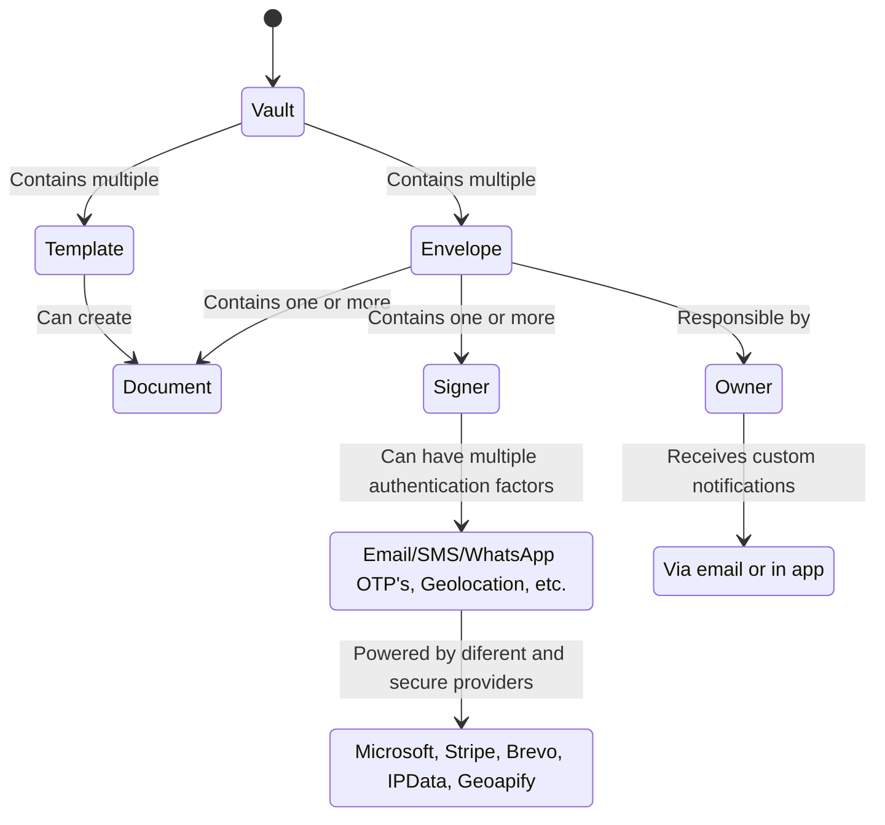

# Concepts

The Signater API introduces key concepts fundamental to understanding how the system operates. Below, we outline these core concepts, including differences in terminology between the API and the web interface, to provide clarity and improve your integration experience.

## Envelope

An Envelope represents a container that holds one or more documents (referred to as Document) and one or more signers (referred to as Signer). The terminology used in the Signater API differs slightly from the web interface to optimize user experience:

- In the API, we use the term "envelope," while the web interface uses "document".

- The API uses "document," whereas the web interface refers to it as "file".

- Publishing an envelope in the API corresponds to "sending a document for signing" in the web interface.

- Reviewing an envelope in the API is referred to as "signing a document" in the web interface.

Each envelope has an owner, who is responsible for managing the envelope and receives all notifications related to its status, including publication, reminders, signer actions, and expiration alerts.

An envelope must contain at least one document and one signer to be published. It includes metadata such as:

- **Signature order**: Defines whether signers must sign in sequence.

- **Expiration date and publication scheduling**: Specifies when an envelope expires or when it should be sent for signing.

- **Vault placement**: Every envelope is stored within a vault.

- **Name, public description, and private description**.

- **Email message for signers**.

- **Reminder settings**: Signater can send up to 7 daily reminders after publication and 7 reminders before expiration. Expiration reminders take precedence, and signers can opt out of these emails via a link included in each reminder.

## Document

A Document within an envelope has individual metadata, including:

- **Name** and **public/private descriptions**.

- **Language and markupOrientation**: Controls whether and where markings (including the Signater logo, document ID, envelope ID, public access link, and QR code) are displayed on the document. Markup orientation options include footer, right, left, top, or none.

## Signer

A Signer is an individual who must complete authentication and perform actions within an envelope. Signers have:

- **Name**, **email** (optional), **phone number**, and **document** information.

- **Role**: Signer roles include "Sign," "Acknowledge," etc.

- **Title**: Such as "Lawyer" or "Director".

- **Authentication factors**: Signater supports multiple authentication methods to ensure signer identity:

    - OTP via email, SMS, or WhatsApp.

    - Passcode and geolocation.

    - Upcoming factors: Pix, gov.br, custom certificates (eCPF, eCNPJ), selfie, ID document photo, facial recognition, and facial recognition with liveness detection.

    - Mandatory automatic factors: One-time access links, IP-based location with proxy/VPN detection.

Signers may also be required to place visible signature marks or rubric marks on predefined areas of the document.

## Vault

A Vault (Cofre) in Signater is a secure repository used to store envelopes and templates. Each vault has:

- **Name** and **description**.
- **Access type**, which defines who can view its contents:
    - **Private**: Accessible only to the user who created it.
    - **Public** to the account: All users within the account have access.
    - **Member based**: Specific users can be granted access.
Vaults provide a structured, secure way to organize and manage sensitive documents within the Signater system.

## Template

A Template simplifies creating documents by allowing the reuse of pre-defined metadata and fields. Templates contain:

- **Predefined fields** (custom fields): These fields can be filled quickly when creating a new document.
- **Document structure and metadata**: Includes the name, descriptions, and any placeholders for data entry.

By leveraging templates, users can significantly reduce the time needed to prepare documents for signing, improving efficiency and consistency across recurring workflows.

## End-to-End Encrypted Digital Signature

Signater is the only platform in the market that applies end-to-end encryption to every signature, ensuring unmatched security and reliability for digital signing. Each signer action leads to a new digital signature on every document in the envelope:

- If a document contains 5 signature marks and 3 rubric marks, Signater adds 8 separate digital signatures.

- Even without visible marks, Signater applies one "invisible" digital signature, preventing undetectable modifications.

This approach differs from competitors, where signatures may be rewritten, compromising their legal validity. Signater’s immutable signatures guarantee full traceability, making tampering impossible without invalidating the document.
