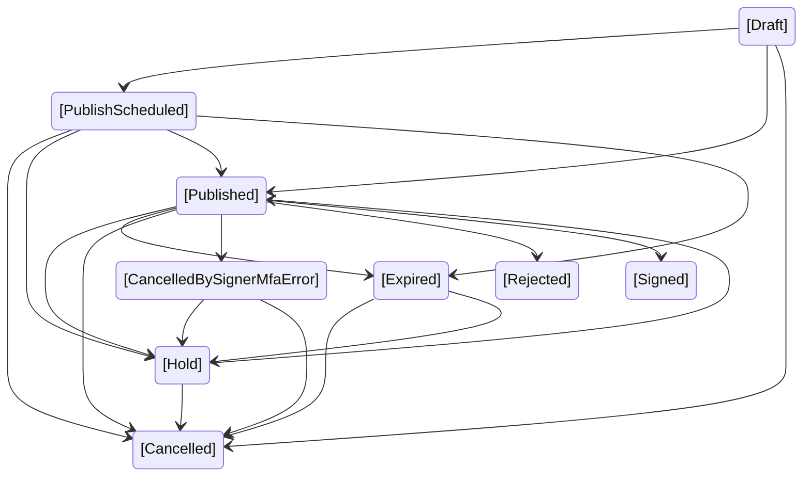

# Envelope lifecycle

The diagram below illustrates the lifecycle of an envelope in the Signater platform. It covers the various states an envelope can go through, from its creation to its final status. Each transition represents a significant change in the envelope's lifecycle.

## Explanation of States

- **Draft (Initial State)**
    - This is the initial state when an envelope is created but not yet published. It is considered a "work-in-progress" and is not visible to the signers. The envelope can either move to the PublishScheduled state, be published directly, or be Cancelled.
- **PublishScheduled**
    - The envelope is scheduled for publication but has not yet been made available for signing. This state can transition to Published once the envelope is published, to expired, or it can be Cancelled if the envelope is no longer needed.
- **Published**
    - The envelope has been published and is now available for the signers. It can be in several possible outcomes from this point:
    - It can move to Hold if there is a temporary pause on the signing process.
    - It can Expire if the signers do not complete the process within the set time.
    - It can be Cancelled if the envelope is no longer required.
    - It can be CancelledBySignerMfaError if an issue with the signer's multi-factor authentication causes cancellation.
    - It can be Rejected if the signer decides not to proceed with signing.
    - It can be Signed if the signer successfully completes the signing process.
- **Hold**
    - The envelope is on hold, meaning it is temporarily paused and cannot be signed until it is either resumed or cancelled. This state can transition to Published once the envelope is ready for signing again, or it can be Cancelled if no further action is required.
- **Expired**
    - If the envelope is not signed within the specified time frame, it will expire. Once expired, the envelope can either be Cancelled if it is no longer relevant or moved back to Hold if the expiration was resolved and action is needed to continue the signing process.
- **Cancelled**
    - The envelope has been cancelled and is no longer in use. This can happen at any point during the lifecycle, including from Draft, PublishScheduled, Published, Hold, or Expired states.
- **CancelledBySignerMfaError**
    - This state occurs when an error happens with the signer's multi-factor authentication process, causing the envelope to be cancelled. It is specific to security-related issues during the signing process. In this case, the envelope can be cancelled definitively or changed to on hold to be published again.
- **Rejected (Final State)**
    - The signer rejected the envelope, meaning they decided not to proceed with signing it. This is a terminal state, as the signing process cannot be completed.
- **Signed (Final State)**
    - The envelope has been successfully signed by all required signers. This is the final, completed state for an envelope.

## Summary of Final States
The lifecycle of an envelope typically ends in one of the following states:

- **Signed**: The envelope has been successfully signed by all participants.
- **Cancelled**: The envelope has been cancelled for various reasons, either by the creator or due to issues like authentication failure.
- **Rejected**: The envelope was rejected by the signer and cannot proceed further.

Each of these final states represents the termination of the envelope lifecycle, either through completion or cancellation.

## Envelope Removal

Any envelope can be removed from the system by moving it to the **Trash**. When an envelope is placed in the trash, it does not alter its current status (e.g., **Published**, **Signed**, **Cancelled**). The envelope can be restored from the trash if needed, and its status will remain unchanged after restoration.

This feature allows for a temporary removal of envelopes from active views or workflows without permanently deleting them. It provides flexibility in managing envelopes without affecting their lifecycle state.

- **Removed to Trash**: The envelope is no longer active but can be restored.
- **Restored from Trash**: The envelope returns to its original state without any changes to its lifecycle status.

